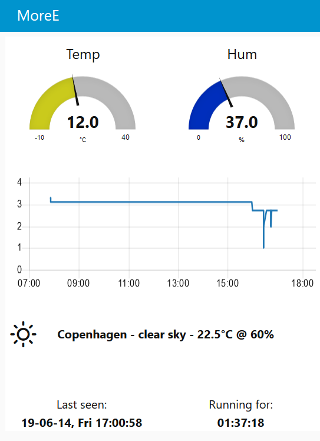
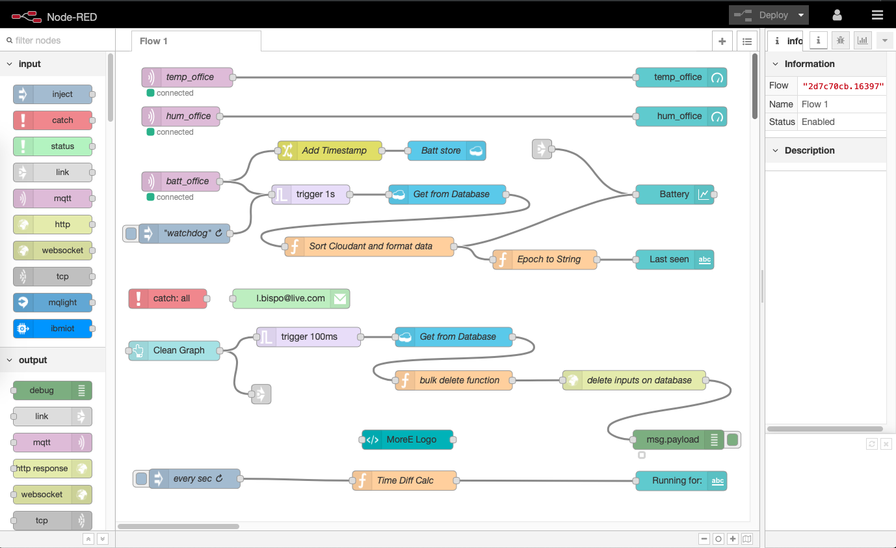
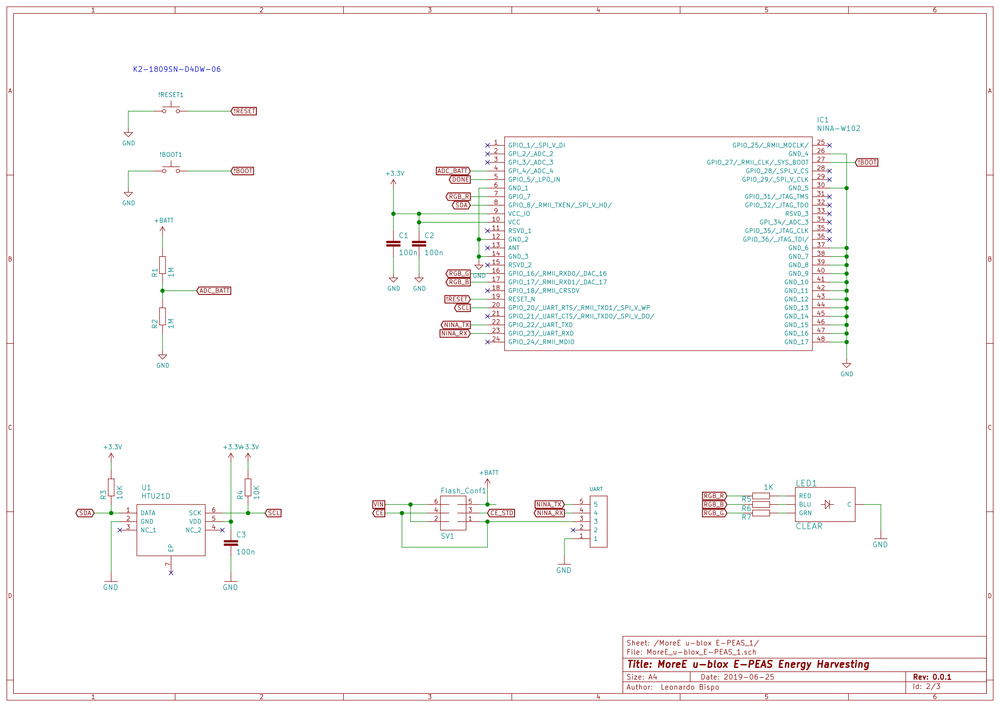
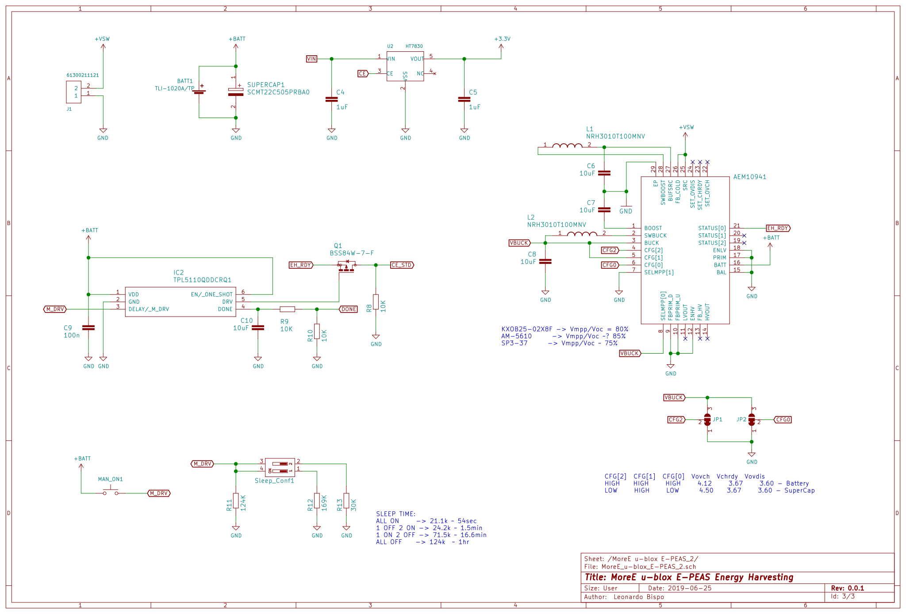
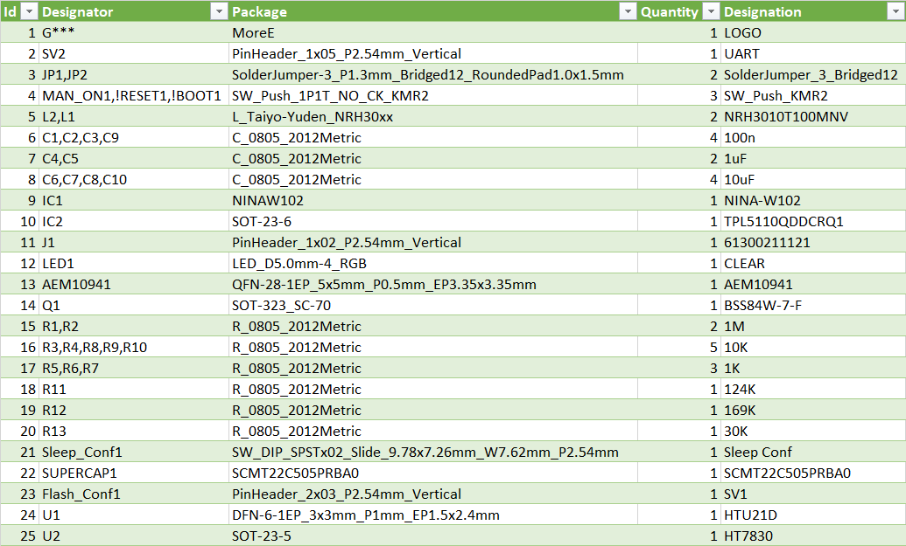

# Node-RED-Energy-Harvesting-dashboard

Node-RED Energy Harvesting dashboard example, weather forecast, temperature and humidty measurement. MQTT, ESP32, u-blox NINA-W10, HTU21D, IBM Cloud, CloudMQTT

[](https://github.com/ldab/Node-RED-Energy-Harvesting-dashboard/releases/latest)
[](https://travis-ci.org/ldab/Node-RED-Energy-Harvesting-dashboard)
[](https://github.com/ldab/Node-RED-Energy-Harvesting-dashboard/blob/master/LICENSE)

[](https://github.com/ldab/Node-RED-Energy-Harvesting-dashboard)

[](https://www.u-blox.com/en/product/nina-W10-series)

## Sumary

1. [How to build PlatformIO based project](/README.md#How-to-build-PlatformIO-based-project)
2. [TODO](/README.md#TODO)
3. [Energy Harvesting](/README.md#Energy-Harvesting)
4. [MQTT Broker](/README.md#MQTT-Broker)
5. [IBM Node-RED Hosting](/README.md#IBM-Node-RED-Hosting)
6. [Node-RED Flow](/README.md#Node-RED-Flow)
7. [OpenWeatherMap API](/README.md#OpenWeatherMap-API)
8. [Node-RED Notification](/README.md#Node-RED-Notification)
9. [Calibrating ADC for ESP32](/README.md#Calibrating-ADC-for-ESP32)
10. [Partition Table and Flash size](/README.md#Partition-Table-and-Flash-size)
11. [Erase Flash](/README.md#Erase-Flash)
12. [PCB](/README.md#PCB)
13. [Final Thoughts or Improvements](/README.md#Final-Thoughts-or-Impovements)
14. [Credits](/README.md#Credits)

## How to build PlatformIO based project

1. [Install PlatformIO Core](http://docs.platformio.org/page/core.html)
2. Download [development the repository with examples](https://github.com/ldab/Node-RED-Energy-Harvesting-dashboard)
3. Extract ZIP archive
4. Run these commands:

```
# Change directory to example
> cd Node-RED-Energy-Harvesting-dashboard

# Build project
> platformio run

# Upload firmware
> platformio run --target upload

# Build specific environment
> platformio run -e nina_W10

# Upload firmware for the specific environment
> platformio run -e nina_W10 --target upload

# Clean build files
> platformio run --target clean
```

## TODO

- [ ] More detailed IBM deploy;
- [ ] Details on the flows;
- [x] Node to be installed;
- [ ] Energy Harvesting details;

## Energy Harvesting

### Energy Budget

#### While Communicating

Component | ~Typ mA
----------|--------
NINA-W102 |120

#### While Sleep (TPL5110)

Component | ~Typ μA
----------|--------
TPL5110   |0.035
Cap leak  |30
LDO       |1
Passive   |5

* The code takes in average 2000ms to execute;
* Wakes up every hour;
* 10 hours of charging soruce;


## MQTT Broker

The MQTT Broker used is [CloudMQTT](https://www.cloudmqtt.com/) they offer Free accounts 😉 that works just fine.

## IBM Node-RED Hosting

The process was a bit tedious and took a while to get it properly running as of today (2019/06/15) the information provided on the tutorial had few broken links.

[https://nodered.org/docs/platforms/bluemix](https://nodered.org/docs/platforms/bluemix)

## Node-RED Flow

### Install required nodes

* Menu -> Manage Palette -> Install tab. You will need `node-red-node-openweathermap` and `node-red-dashboard`

### Import Node example

* Copy the flow below and import to your Nore-RED available at `yournode.eu-gb.mybluemix.net/red` Import > Clipboard, paste it.

You will find the flow.json [here](./Node-RED%20flow/flows.json).



### Cloudant Credentials for cleaning database

* Generally Cloudant autheticate via IBM cloud therefore we need to create new Credentials and use the username and password for authentication on the `delet inputs on database` node.


## OpenWeatherMap API

* In order to get the weather forecast information for the OpenWeatherMap node, you will need to get your API at [https://openweathermap.org/api](https://openweathermap.org/api)
* Then define your location and the information you would like to show on the "Forecast String" node:
```
{
  "coord":{"lon":139,"lat":35},
  "sys":{"country":"JP","sunrise":1369769524,"sunset":1369821049},
  "weather":[{"id":804,"main":"clouds","description":"overcast clouds","icon":"04n"}],
  "main":{"temp":289.5,"humidity":89,"pressure":1013,"temp_min":287.04,"temp_max":292.04},
  "wind":{"speed":7.31,"deg":187.002},
  "rain":{"3h":0},
  "clouds":{"all":92},
  "dt":1369824698,
  "id":1851632,
  "name":"Shuzenji",
  "cod":200
}
```

## Node-RED Notification

* Via the `catch` node, you can enable notification, for your phone for example. Below I have quickly show few options:

1. Email

  * Use the `email` output, configured with your email provider info;

2. PushSafer

  * Offers several customizations, sound, vibration, icons, etc:
  * GET request url: `https://www.pushsafer.com/api?k=YOURKEY&c=%23ff0000&v=1&a=1&m={{payload}}`

5. Twilio SMS

  * SMS API, built-in to the Node-RED and IBM example;

6. IFTT

  * If this than that, with android and iOS apps can be accesible via webhooks;
  * GET `https://maker.ifttt.com/trigger/YOUR_EVENT/with/key/YOUR_KEY?value1=MESSAGE`

## Calibrating ADC for ESP32

* ADC on ESP32 has been reported being innacurate, therefore one can use ```adc2_vref_to_gpio( GPIO_NUM_25 );``` to route `Vref` to `GPIO_NUM_25` and measure it in order to calibrate during ADC measurement.
* Calling for `esp_adc_cal_characterize(ADC_UNIT_1, ADC_ATTEN_DB_6, ADC_WIDTH_BIT_11, Vref, adc_chars);`

## Partition Table and Flash size

* You can create a custom partitions table (CSV) following [ESP32 Partition Tables](https://docs.espressif.com/projects/esp-idf/en/latest/api-guides/partition-tables.html) documentation.

* Partitions examples are available at [GitHub arduino-esp32](https://github.com/espressif/arduino-esp32/tree/master/tools/partitions)

* `minimal.csv` is the default defined on [nina_w10.json](https://github.com/platformio/platform-espressif32/blob/master/boards/nina_w10.json) however I changed it in order to free some space up used by spiffs found on `partitions_custom.csv` [here](./partitions_custom.csv)
  * No OTA;
  * No SPIFFS;
  * No EEPROM;

## Erase Flash

`pio run -t erase` - > all data will be replaced with 0xFF bytes.

## PCB


### Schematic

 

 

### Enclosure

 

### BOM

[BOM u-blox E-PEAS](./extras/BOM.csv)

 

## Final Thoughts or Improvements

* Use 3.0V LDO, HT7830;
* Replace LDO for a smaller drop-out voltage or lower power-down current;
* Use a Buck/Boost converter instead of LDO in order to discharge super cap until 2.8V;

## Credits

GitHub Shields and Badges created with [Shields.io](https://github.com/badges/shields/)

Weather information from [OpenWeatherMap](https://openweathermap.org)

Webcam picture from [webcam.travel](https://www.webcams.travel)

Adafruit HTU21D GitHub [Library](https://github.com/adafruit/Adafruit_HTU21DF_Library)
